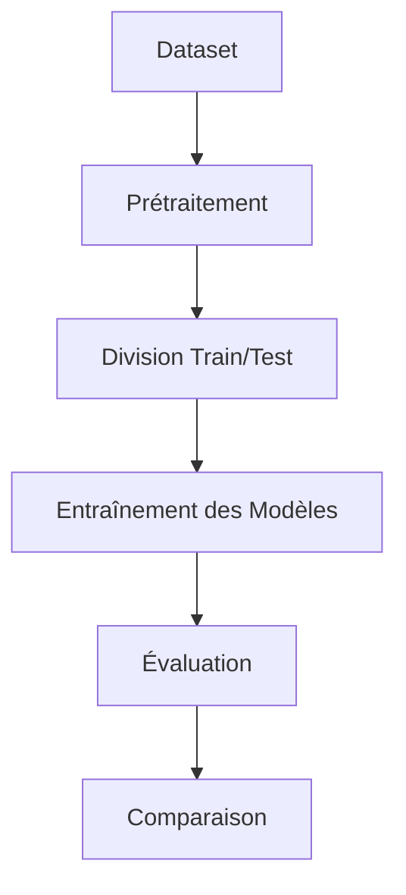

# Étude Comparative des Algorithmes Non Supervisés
Détection de Malwares à partir d'Exécutables

---
layout: two-cols
---

# K-Means Clustering

::right::

- Algorithme de partitionnement
- Divise les données en K clusters
- Principe:
  1. Initialisation aléatoire des centroids
  2. Attribution des points au centroid le plus proche
  3. Recalcul des centroids
  4. Répétition jusqu'à convergence

---
layout: two-cols
---

# DBSCAN

::right::

- Clustering basé sur la densité
- Avantages:
  - Détecte les clusters de forme arbitraire
  - Identifie les points de bruit
- Paramètres clés:
  - eps: rayon de voisinage
  - min_samples: nombre minimum de points

---
layout: two-cols
---

# Gaussian Mixture Model (GMM)

::right::

- Modèle probabiliste
- Suppose que les données suivent plusieurs distributions gaussiennes
- Caractéristiques:
  - Clustering souple (probabilités d'appartenance)
  - Adapté aux clusters de forme elliptique
  - Utilise l'algorithme EM

---
layout: default
---

# Méthodologie

---
layout: two-cols
---

# Métriques d'Évaluation

- Silhouette Score
  - Mesure la qualité des clusters
  - Score entre -1 et 1

::right::

- Davies-Bouldin Index
  - Évalue la séparation des clusters
  - Plus petit = meilleur

- Homogeneity/Completeness
  - Pour validation avec labels connus

---
layout: center
---

# Comparaison des Résultats

| Algorithme | Silhouette Score | Davies-Bouldin | Temps d'exécution |
|------------|------------------|----------------|-------------------|
| K-Means    | {score}          | {score}        | {temps}          |
| DBSCAN     | {score}          | {score}        | {temps}          |
| GMM        | {score}          | {score}        | {temps}          |

---
layout: end
---

# Merci de votre attention

Questions ?